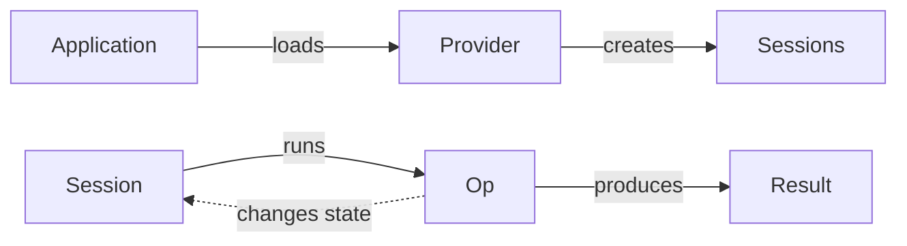

# Alpaca Core SDK: Introduction

The Alpaca Core SDK, is a multi-platform SDK for building applications which include an abstract compute-heavy layer. 

An application built with the SDK can load plugins which implement some computation and use them via a socket-like interface. The socket-like interface allows a relatively easy way to use plugins from different languages and platforms. The plugins themselves must be SDK-aware and be created in C++.

The SDK also introduces the Stateful Session Protocol. In and of itself, the protocol is not bound to C++ or any concrete programming language. It is a specification for a way to communicate between a client and a server. The SDK provides a C++ implementation of the protocol and tools for building plugins. Hence the need for plugins to be written in C++.

A rough picture of how an SDK-powered application works is as follows:



### Plugins and Providers

The SDK itself doesn't implement any computation. In order to get access to a functionality one needs a provider. Typically providers would come from plugins. A plugin is a shared library which implements one or more providers. 

A provider is a factory for sessions. 

### Sessions and Ops

The sessions are the main objects which do the work. A session in terms of the SDK is nothing more than a socket-like object which can accept frames of data as input and produce frames as output.

Sessions can run ops. You can think of ops as functions. They take input frames and produce output frames. The key part is that ops change the state of the session. 

For example if a session is in a state where it can do X, and you run an op, the resulting state maybe such that X is no longer possible, but Y is.

### Example

Now, this is all pretty abstract, so let's give an example. In pseudo-code:

```python
session = provider.create_session
session.load_model("llama-2-7b") # load a model
session.create_instance() # create an inference instance
result = session.complete_text("A recipe for rice cakes:") # run and get result
print(result) # consume the result

session.load("stable-diffusion-3") 
# error! the state of the session is no longer one that can load 
```

## Protocol

The example above is pretty neat, but our goal is to have allow access to multiple providers. Having functions like `.complete_text("text")` simply makes no sense for a provider of image generation.

As mentioned above, the communication protocol defines *frames*. A frame is a piece of structured data. Some close (but not quite complete) descriptions of it could be duck-typed, or "stringly"-typed, or JSON-typed.

Every provider defines a schema. The schema describes things what ops are possible in the current state and what states are there.

If we know the schema of a provider we can use it like this *(still pseudo-code)*:

```python
session.push(op = "load", model = "llama-2-7b")
session.push(op = "create_instance", type = "general", context_size = 1024)
session.push(op = "complete_text", input = "A recipe for rice cakes:", max_tokens = 2000)
result = session.poll()

# consume the result
recipe = result["text"]
print(recipe)
```

...and now we can also do:

```python
session.push(op = "load", model = "stable-diffusion-3")
session.push(op = "create_instance", type = "general", resolution = 512)
session.push(op = "generate", prompt = "A 17th century oil on canvas portrait of Darth Vader") 
result = session.poll()

# consume the result
image_bytes = result["image"]
img = Image.open(io.BytesIO(image_bytes))
img.show()
```

To make this pseudo-code not-so-pseudo and more or less equivalent to the first example, we can use code generation from a schema.

Code generation is planned for the near future. Until then we only provide C++ utilities for strong types. Which can make the examples above look like this real C++ code:

```cpp
ac::local::Lib::loadAllPlugins(); // load all plugins
ac::frameio::BlockingIoCtx blockingCtx; // context for blocking IO from our side 
                                        // (easier to write demos in)
ac::local::IoCtx io; // io context for the plugins

auto& llamaProvider = ac::local::Lib::getProvider("llama"); // get the compute provider

// create a connection and attach it to a schema-based io helper
// it being schema based allows us to use strong types below
ac::schema::BlockingIoHelper llama(io.connect(dummyProvider), blockingCtx); 

namespace schema = ac::schema::llama; // shorthand for the llama schema

// await the connection and load a model
llama.expectState<schema::StateInitial>();
llama.call<schema::StateInitial::OpLoadModel>({.ggufPath = "/path/to/model.gguf"});

// start an inference instance
llama.expectState<schema::StateModelLoaded>();
llama.call<schema::StateModelLoaded::OpStartInstance>({.instanceType = "general"});

// run the inference to complete a piece of text
llama.expectState<schema::StateInstance>();
auto result = llama.call<schema::StateInstance::OpRun>({
    .prompt = "A recipe for rice cakes:"
});

std::cout << result.text << "\n";
```
